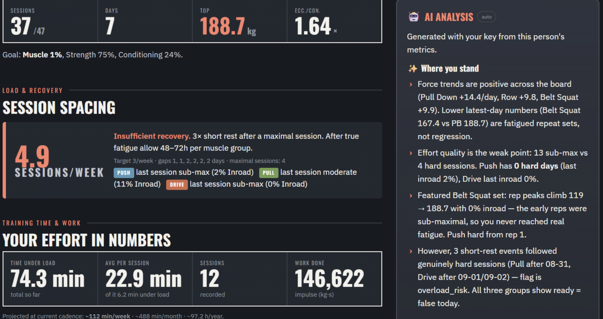
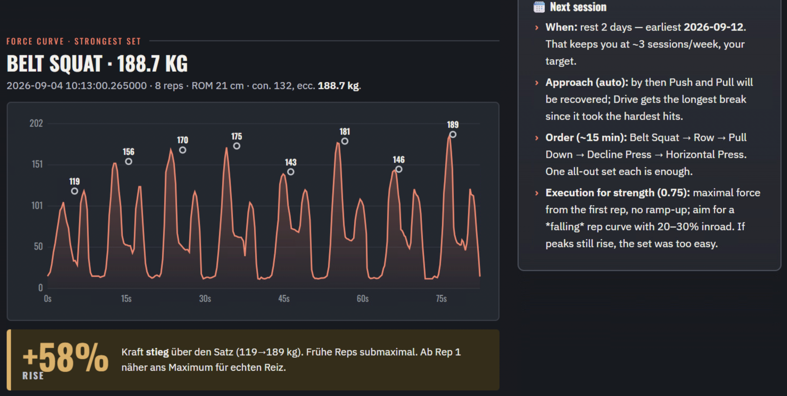
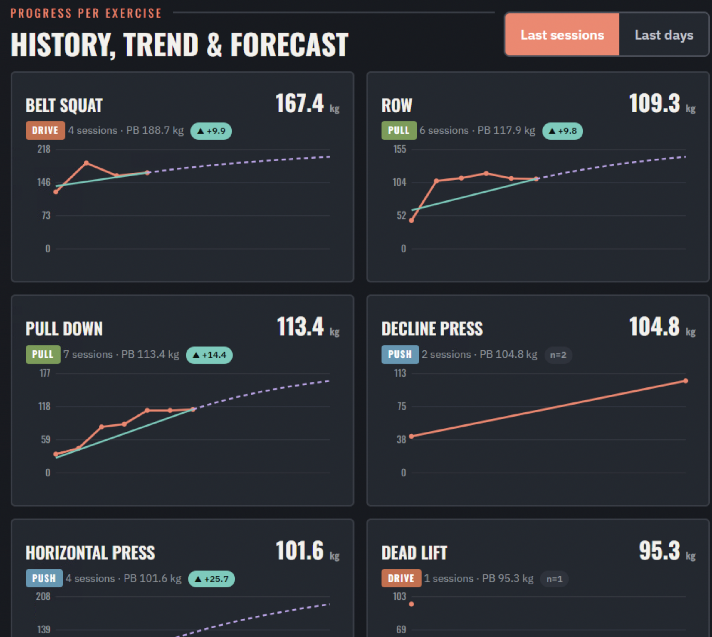
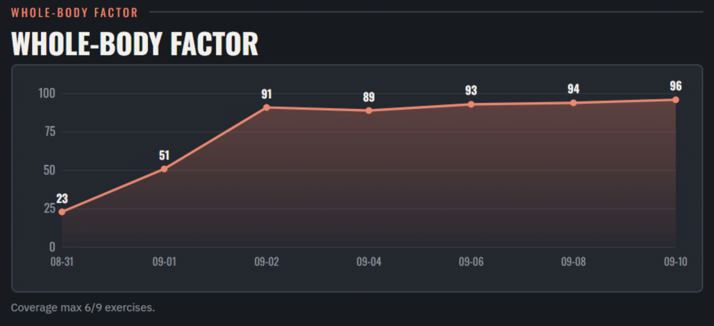
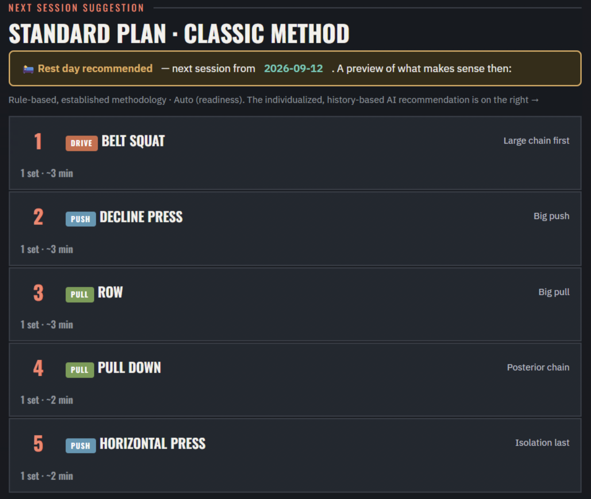

<!-- ARX Insight -->
<p align="center">
  
</p>

       

<h1 align="center">ARX Insight</h1>

<p align="center">
  <b>Local, private strength analytics for the ARX adaptive-resistance machine.</b><br>
  Reads your training data straight off the machine, turns it into real sport-science metrics,<br>
  and gives you AI-written feedback — all on your own PC, with your own API key.
</p>

<p align="center">
  
  
  
  
</p>

---

## Why this exists

ARX gives you a brilliant machine, but its analysis lives only in the cloud, with no way to
dig into your own numbers over time. Yet all of your data sits **locally** on the PC next to the
machine. **ARX Insight** is the missing local companion: it opens a read-only copy of that data
and shows you what actually happened — and what to do next.

> Not affiliated with ARX. Independent, community-made, experimental. Not medical advice.

## What you get

- 📈 **Force curve of your strongest set** — the full ~20 Hz curve, with the peak of every rep.
- 🔥 **Effort / inroad** — did the set reach deep fatigue, or were the early reps sub-maximal?
- 🧭 **Progress per exercise** — best set per day, with trend and a cautious forecast, on two axes (last sessions / last days).
- 📏 **Range-of-motion validity** — force is only compared between days that used the same ROM (within 5 % of the exercise's reference). Days with a different ROM are shown but excluded from trend and forecast, and the exercise gets a visible ROM warning instead of a fake trend.
- 🧾 **Session sequence** — the order of your sets within each day, the rest before each one, machine pauses, work density, and rule-based flags: too many sets, a scattered full-body day on a split plan, the same exercise or muscle hit again within 5 minutes, and a density shift that betrays changed pause/tempo settings.
- 🤝 **Shared limiters** — knows that Dead Lift, Row, Pull Down and Biceps Curl all hang on the grip: it spots a limiter pre-fatigued by an earlier set, lists the conflicts per day, and orders the plan so a "means" exercise comes before the one that targets that same structure.
- 🧍 **Whole-body index** — a self-referenced score of how close you are to your own bests, across Push / Pull / Drive.
- 🛌 **Load & recovery, effort-aware** — the 48–72 h rule only applies after a *truly maximal* session; a sub-maximal day needs far less. It even tells you **when to train next**.
- 🗓️ **Next-session plan** — a ~15-minute, muscle-group-balanced suggestion (which exercises, in what order, and when).
- 🎯 **Focus & approach** — prefer upper body or arms and it de-emphasizes or drops legs; choose **Auto** (auto-regulates by readiness, gets smarter with more data), **Full body**, or a **Split**.
- ⚠️ **Injury-aware** — flag a shoulder, knee, etc. as *careful* or *avoid*, and the plan won't push it.
- ⏱️ **Training time & work** — motivational totals, per week / month / year.
- 🤖 **AI analysis** in plain language, using **your own** Claude API key (only aggregated, name-free numbers are sent) — loads automatically beside the report and into the PDF. It also receives the ordered session sequences and may point out patterns the rules don't cover; the computed metrics stay the ground truth. Cost is tunable via `ai_effort` (low … max, default medium) in `config.json`.
- 🌍 **English / German**, **lb-inch / kg-cm**, big touch-friendly UI, one-click **PDF**, and an **update notice** when a new version ships.

<p align="center"><i>Example report (anonymized):</i></p>
<p align="center">
  <!-- Add a real screenshot here after your first run, e.g. docs/example-report.png -->
  
  
  
  
  
</p>

## Install on Windows (plug and play)

No IT knowledge needed.

1. On the GitHub page click **Code → Download ZIP**, then unzip it anywhere (e.g. your Desktop).
2. Open the unzipped folder and **double-click `Install ARX Insight.bat`**.
3. That's it. The installer will, fully automatically:
   - install Python if it's missing,
   - set up a private environment and the two required packages,
   - download the Firebird database client if needed,
   - **find your ARX database automatically** (or ask you to pick the file `DB.FDB4`),
   - put an **“ARX Insight” shortcut on your Desktop**, and
   - open the app in your browser.

Next time, just use the Desktop shortcut (or `Start ARX Insight.bat`).

### First screen

On first launch you set language, units, your weekly training target, and — optionally — your
Claude API key (for the AI analysis). Then search a person by name, set a training goal with two
simple sliders, and read the report. **Exit** returns you to the search screen.

## Run it manually (macOS / Linux / advanced)

```bash
python -m venv .venv
. .venv/bin/activate            # Windows: .venv\Scripts\activate
pip install -r requirements.txt
python arx_app.py --db "/path/to/Resources/DB.FDB4"
```

Or generate just the report data (no UI): `python arx_report.py --db "..." --ai`.

## How it works

| Piece | Role |
|---|---|
| `arx_report.py` | Read-only engine: opens a **copy** of the Firebird DB, computes every metric, optionally calls Claude |
| `arx_app.py` | Tiny local web server + the touch UI in `web/` |
| `exercises.json` | ARX Omni catalog: exercise code → name / muscle group / compound-isolation |
| `config.json`, `goals.json` | Your settings and per-person goals (kept **out** of git) |

The ARX database is never modified — the tool always works on a temporary copy.

## Privacy

Everything runs on your machine. Your API key lives only in the local, git-ignored `config.json`.
The AI request contains **only aggregated, name-free metrics** — never a person's name. The
database, your keys, goals and generated reports are all git-ignored.

## Disclaimer

ARX Insight is an **experimental aid**, not medical, therapeutic, or professional training advice.
**No liability** is accepted; anything you derive from it is at your own risk. If you feel pain or
suspect an injury, consult a physician or qualified trainer.

## FAQ

**How exactly do I install it on Windows? (step by step)**
1. Open your web browser and go to this GitHub page: `https://github.com/joergs-git/arx-insight`.
2. Click the green **`< > Code`** button, then **Download ZIP**. Save the file (it lands in your **Downloads** folder).
3. Open **Downloads**, **right-click** the file `arx-insight-main.zip` → **Extract All…** → **Extract**. A folder `arx-insight-main` opens.
4. Open that extracted folder and **double-click `Install ARX Insight.bat`**.
5. If Windows shows a blue *“Windows protected your PC”* box, click **More info → Run anyway** (it's an unsigned script; the source is this repo).
6. Wait. The installer sets everything up, finds your ARX database, and opens the app in your browser. It also puts an **“ARX Insight”** icon on your Desktop — use that next time.

To **update** later: repeat steps 1–4 (download the ZIP again, extract, run the installer). Your settings and goals are kept, and a running old version is replaced automatically.

**Where do I get a Claude API key?**
Create one at [console.anthropic.com](https://console.anthropic.com/settings/keys) → *API Keys*.
Paste it into ⚙ *Settings* in the app. It stays on your machine, and the app sends only
aggregated, name-free numbers — never a person's name.

**Do I need the key at all?**
No. Everything except the AI text works without it: force curves, progress, load & recovery,
the rule-based plan. The key only powers the automatic AI analysis on the right.

**What methodology does it use?**
Force (kg/lb) is the progress measure on an adaptive-resistance machine, not "weight". Effort is
judged by **inroad** — the force decline across a set. Progress compares the *best set per day*
(repeated sets in one session are treated as fatigue, not regression) — and only between days
with the **same range of motion**: on an adaptive-resistance machine a shorter ROM stays in the
strong part of the movement and yields a higher peak, so force values from differing ROMs are not
comparable and are excluded from trend and forecast (fewer than 3 comparable days → no trend).
Effort is measured per rep (BeginRep/EndRep segmentation), the same definition the force curve
shows. Recovery is **effort-conditioned**: ~48–72 h only after a genuinely maximal session, far
less after a sub-maximal one. Within a day the **sequence** is analysed too: rest between sets,
work density per wall-clock minute, repeats of the same exercise or of the same limiting muscle
(grip, elbow flexors, triceps, lower back …) within a few minutes. The session plan follows
classic ordering (large muscle groups first, and an exercise that merely *uses* a limiter before
one that *targets* it); the **Auto** approach auto-regulates by readiness and gets smarter as your
history grows. The AI layer adds an individualized, history-based recommendation on top.

**Why does an exercise say "no trend · ROM"?**
Its range of motion changed between sessions by more than 5 %, so the force values of those days
cannot be compared. Set fixed start and end positions for that exercise on the machine; once three
comparable days exist, the trend returns.

**What is a "limiter"?**
The structure that gives out first even though it is not what the exercise is for — the grip on
a Dead Lift or Row, the triceps on a press. Several exercises sharing a limiter fatigue it
cumulatively within one session. `exercises.json` carries `targets` and `limiters` per exercise;
you can extend the vocabulary there.

**Will it change or damage my ARX data?**
No. It only ever reads a temporary **copy** of the database.

**How do I update?**
The app checks GitHub on start and shows a banner when a newer version exists. Download the ZIP
again and re-run the installer — your settings, goals and environment are kept.

**I have an idea or found a bug — how do I help?**
Open an [issue or discussion](https://github.com/joergs-git/arx-insight/issues) on GitHub, or send
a pull request. Feedback on the methodology and the recommendations is very welcome.

## License

[CC0 1.0](LICENSE) — public domain. Do whatever you like. No warranty.

<p align="center" style="font-size:11px;color:#888">
  <sub>© <a href="https://github.com/joergs-git" target="_blank" rel="noopener">joergs-git</a> · community project, not affiliated with ARX</sub>
</p>
