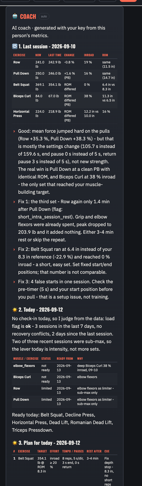
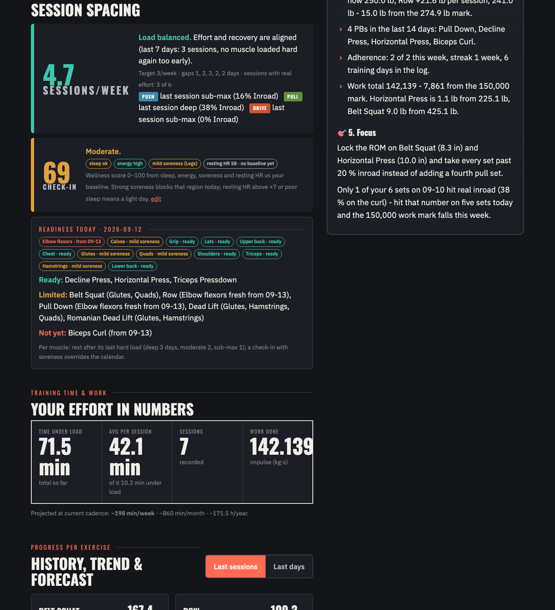
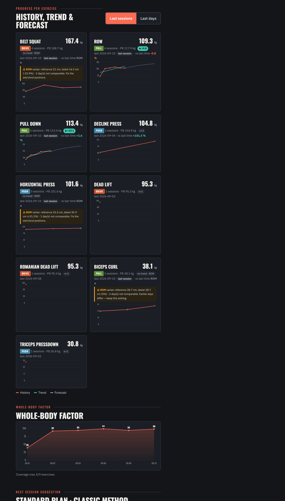
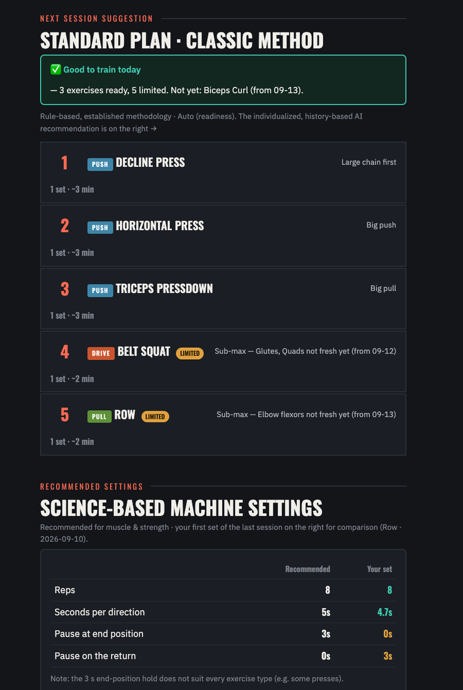

<!-- ARX Insight -->
<p align="center">
  
</p>

       

<h1 align="center">ARX Insight</h1>

<p align="center">
  <b>Local, private strength analytics for the ARX adaptive-resistance machine.</b><br>
  Reads your training data straight off the machine, turns it into real sport-science metrics,<br>
  and gives you AI-written feedback — all on your own PC, with your own API key.
</p>

<p align="center">
  
  
  
  
</p>

---

## Why this exists

ARX gives you a brilliant machine, but its analysis lives only in the cloud, with no way to
dig into your own numbers over time. Yet all of your data sits **locally** on the PC next to the
machine. **ARX Insight** is the missing local companion: it opens a read-only copy of that data
and shows you what actually happened — and what to do next.

> Not affiliated with ARX. Independent, community-made, experimental. Not medical advice.

## What you get

- 🔁 **Last session first** — the exercises you just did, in the order performed, each against the previous time you did them: the force curve with the previous set as a dashed ghost, peak / mean force / inroad / ROM deltas, a new-PB badge, and a note when tempo or pauses changed between the two sets (they shift force values). Below: the session table and whether the day before was too close for the muscles you hit again.
- 🧹 **Only real sets count** — machine tests, familiarisation sets, aborted attempts and false starts (the same exercise restarted a minute later with more reps) are recognised and excluded from every number. The report says how many and why.
- 🔥 **Effort / inroad** — did the set reach deep fatigue, or were the early reps sub-maximal? Measured per rep, the same definition the curve shows.
- 🧭 **Progress per exercise** — best set per day, "vs last time", trend and a cautious forecast, on two axes (last sessions / last days).
- 📏 **Range-of-motion validity** — force is only compared between days that used the same ROM (within 5 % of the exercise's reference). Days with a different ROM are shown but excluded from trend and forecast, and the exercise gets a visible ROM warning instead of a fake trend. A deliberately shortened range on a restricted exercise becomes the new baseline instead of a nag.
- 🧠 **Muscle-level recovery** — readiness is judged per muscle, not by the calendar or by Push/Pull/Drive: a set loads its target muscles at the effort it reached and its limiters one level lighter; a muscle is ready again when the rest its last hard load required has passed (deep 3 days, moderate 2, sub-max 1). Two sessions on consecutive days are fine when they used different muscles. Per exercise you see *ready*, *limited* (a limiter such as the grip is not fresh — train sub-max) or *not ready*, each with a date.
- ☀️ **Daily check-in** (20 seconds, skippable) — sleep, energy, muscle soreness per region, resting heart rate against your own baseline, pain today. Strong soreness blocks that region whatever the calendar says; an elevated resting HR or poor sleep means a light day; pain makes a body part *careful* for today. A transparent 0–100 wellness score (in the spirit of the Hooper / McLean questionnaires) goes to the coach.
- 🛌 **Load flag on the last 7 days** — *overload* only when a muscle was loaded hard again before its rest was over (or the check-in says so), *underload* when every recent session was light, *detraining* after 10+ days off. Not judged on your first weeks forever.
- 🧾 **Session sequence** — the order of your sets within each day, the rest before each one, machine pauses, work density, false starts, and rule-based flags: too many sets, a scattered full-body day on a split plan, the same exercise or muscle hit again within 5 minutes, and a density shift that betrays changed pause/tempo settings (only against a consistent baseline).
- 🤝 **Shared limiters** — knows that Dead Lift, Row, Pull Down and Biceps Curl all hang on the grip: it spots a limiter pre-fatigued by an earlier set, lists the conflicts per day, and orders the plan so a "means" exercise comes before the one that targets that same structure.
- 🧍 **Whole-body index** — a self-referenced score of how close you are to your own bests (ROM-comparable days only), across Push / Pull / Drive.
- 🗓️ **Next-session plan** — a ~15-minute, muscle-group-balanced suggestion; in **Auto** mode only recovered exercises, limited ones last with the reason, and a rest day only when nothing is recovered.
- 🎯 **Focus & approach** — prefer upper body or arms and it de-emphasizes or drops legs; choose **Auto** (auto-regulates by readiness), **Full body**, or a **Split**.
- ⚠️ **Injury-aware** — flag a shoulder, knee, etc. as *careful* or *avoid* (which exercises a joint touches is editable per exercise in `exercises.json`), and the plan won't push it. A "limits respected?" box lists sets of the last 14 days that went hard on a careful exercise, jumped in the eccentric, or trained an avoided one — a mirror, not a diagnosis.
- ⏱️ **Training time & work** — motivational totals (sessions = real visits), per week / month / year.
- 🤖 **AI coach** using **your own** Claude API key (only aggregated, name-free numbers are sent) — a whiteboard, not a wall of text: **1)** last session vs the previous time, **2)** today (check-in verdict, what is recovered and from when), **3)** the plan as a table with a concrete force target per exercise, effort, tempo / pauses, rest and a cue, **4)** progress & milestones (PBs, adherence to your weekly target, the next round marks, work total, deload signal), **5)** one focus point. It also receives the ordered session sequences and may point out patterns the rules don't cover; the computed facts stay the ground truth. Answers are cached per day, so a reload does not bill again. Cost is tunable via `ai_effort` (low … max, default medium).
- 🖨️ **PDF** in the same dark design with the coach board included, 🌍 **English / German**, **lb-inch / kg-cm**, big touch-friendly UI, an **update notice** when a new version ships, and a deep link (`?user=<id>`, `&anon=1` hides the name for screenshots).

<p align="center"><i>Example report (anonymized):</i></p>
<p align="center">
  
  
  
  
  
  
</p>

## Install on Windows (plug and play)

No IT knowledge needed.

1. On the GitHub page click **Code → Download ZIP**, then unzip it anywhere (e.g. your Desktop).
2. Open the unzipped folder and **double-click `Install ARX Insight.bat`**.
3. That's it. The installer will, fully automatically:
   - install Python if it's missing,
   - set up a private environment and the two required packages,
   - download the Firebird database client if needed,
   - **find your ARX database automatically** (or ask you to pick the file `DB.FDB4`),
   - put an **“ARX Insight” shortcut on your Desktop**, and
   - open the app in your browser.

Next time, just use the Desktop shortcut (or `Start ARX Insight.bat`).

### First screen

On first launch you set language, units, your weekly training target, and — optionally — your
Claude API key (for the AI coach). Then search a person by name, set a training goal with two
simple sliders, flag any limitations, answer the 20-second check-in (how you feel today — skippable),
and read the report. **Exit** returns you to the search screen.

## Run it manually (macOS / Linux / advanced)

```bash
python -m venv .venv
. .venv/bin/activate            # Windows: .venv\Scripts\activate
pip install -r requirements.txt
python arx_app.py --db "/path/to/Resources/DB.FDB4"
```

Or generate just the report data (no UI): `python arx_report.py --db "..." --ai`.

## How it works

| Piece | Role |
|---|---|
| `arx_report.py` | Read-only engine: opens a **copy** of the Firebird DB, computes every metric, optionally calls Claude |
| `arx_app.py` | Tiny local web server + the touch UI in `web/` |
| `exercises.json` | ARX Omni catalog: exercise code → name / muscle group / compound-isolation |
| `config.json`, `goals.json` | Your settings and per-person goals (kept **out** of git) |

The ARX database is never modified — the tool always works on a temporary copy.

## Privacy

Everything runs on your machine. Your API key lives only in the local, git-ignored `config.json`.
The AI request contains **only aggregated, name-free metrics** — never a person's name. The
database, your keys, goals and generated reports are all git-ignored.

## Disclaimer

ARX Insight is an **experimental aid**, not medical, therapeutic, or professional training advice.
**No liability** is accepted; anything you derive from it is at your own risk. If you feel pain or
suspect an injury, consult a physician or qualified trainer.

## FAQ

**How exactly do I install it on Windows? (step by step)**
1. Open your web browser and go to this GitHub page: `https://github.com/joergs-git/arx-insight`.
2. Click the green **`< > Code`** button, then **Download ZIP**. Save the file (it lands in your **Downloads** folder).
3. Open **Downloads**, **right-click** the file `arx-insight-main.zip` → **Extract All…** → **Extract**. A folder `arx-insight-main` opens.
4. Open that extracted folder and **double-click `Install ARX Insight.bat`**.
5. If Windows shows a blue *“Windows protected your PC”* box, click **More info → Run anyway** (it's an unsigned script; the source is this repo).
6. Wait. The installer sets everything up, finds your ARX database, and opens the app in your browser. It also puts an **“ARX Insight”** icon on your Desktop — use that next time.

To **update** later: repeat steps 1–4 (download the ZIP again, extract, run the installer). Your settings and goals are kept, the Desktop shortcut is pointed at the new folder, and a running old version is replaced automatically — you can delete the old folder afterwards.

**Can two ARX Insight windows run at the same time?**
No — since v0.3.1 exactly one app process runs. Start it a second time (a stray double-click, or an
old Desktop shortcut) and it tells you that ARX Insight is already running, opens it in the browser
and closes itself. Start a **newer** version and it asks the old one to quit, waits for it and only
then starts, so the old black console window disappears by itself. (Before v0.3.1 a Windows quirk
let the old and the new version run side by side until you closed the old window by hand.) The
black window titled *“ARX Insight – close this window to stop”* **is** the app: closing it stops it.

**The coach panel says “AI coach unavailable” — what now?**
The report itself never depends on the AI. The panel names the reason (rejected or missing key, no
credit, rate limit, no internet, service overloaded, …) and offers **Try again**; only successful
answers are cached, so a failed attempt is never billed twice.

**Where do I get a Claude API key?**
Create one at [console.anthropic.com](https://console.anthropic.com/settings/keys) → *API Keys*.
Paste it into ⚙ *Settings* in the app. It stays on your machine, and the app sends only
aggregated, name-free numbers — never a person's name.

**Do I need the key at all?**
No. Everything except the coach's text works without it: last session comparison, force curves,
progress, muscle-level readiness, check-in, load & recovery, the rule-based plan. The key only
powers the AI coach board on the right (and in the PDF).

**What methodology does it use?**
Force (kg/lb) is the progress measure on an adaptive-resistance machine, not "weight". Effort is
judged by **inroad** — the force decline across a set. Progress compares the *best set per day*
(repeated sets in one session are treated as fatigue, not regression) — and only between days
with the **same range of motion**: on an adaptive-resistance machine a shorter ROM stays in the
strong part of the movement and yields a higher peak, so force values from differing ROMs are not
comparable and are excluded from trend and forecast (fewer than 3 comparable days → no trend).
Effort is measured per rep (BeginRep/EndRep segmentation), the same definition the force curve
shows. Recovery is **effort-conditioned and muscle-level**: a set loads its target muscles at the
effort it reached (deep → 3 days of rest, moderate → 2, sub-max → 1) and its limiters one level
lighter; an exercise is ready when its target muscles are. Consecutive training days are fine
when different muscles were used. The **daily check-in** (sleep, energy, soreness, resting heart
rate, pain — subjective wellness is a well-supported load monitor) can override the calendar.
Within a day the **sequence** is analysed too: rest between sets, work density per wall-clock
minute, repeats of the same exercise or of the same limiting muscle (grip, elbow flexors, triceps,
lower back …) within a few minutes. The session plan follows classic ordering (large muscle groups
first, and an exercise that merely *uses* a limiter before one that *targets* it); the **Auto**
approach auto-regulates by readiness. The AI coach adds the individualized whiteboard on top:
concrete targets from progressive overload (only where the last set showed room), effort by goal,
adherence, milestones and a deload signal (weeks of consistent training that meet falling numbers
or poor readiness).

**Why does it ask how I feel before the report?**
Because a coach would. Sleep, energy, soreness per region, resting heart rate and pain take 20
seconds and change today's plan: strong soreness blocks that region, an elevated resting HR
(more than ~7 bpm above your own baseline, which forms after three morning values) or poor sleep
means a light day, pain makes a body part *careful* for today. You can skip it; it is asked once
per day and editable from the report (☀ Check-in). Everything stays in the local `goals.json`.

**What does "limited" mean for an exercise?**
Its target muscles are recovered, but a *limiter* — the grip, the elbow flexors, the triceps on a
press — is not fresh yet (for example after a deep Biceps Curl two days ago). You can train it
sub-max; the limiter may end the set early. "Not ready" means a target muscle itself still needs
rest; the date tells you when.

**Which sets are excluded, and why?**
Sets under 4 reps or 40 s (machine tests, familiarisation, positioning), sets the machine logged as
ended early with too few reps, and false starts (the same exercise restarted within 3 minutes with
more reps). They would otherwise show up as bogus bests, fatigued "repeats" or short-rest flags. The
report states the count per reason; nothing is deleted.

**How does the coach pick a target?**
From the last ROM-comparable best of that exercise: if the trend is up and the last set stopped
short of real fatigue (inroad under 20 %), it asks for 2 % more force; otherwise the same force,
but taken to the inroad your goal asks for (muscle ≥ 20 %, strength 10–20 %). Careful or limited
exercises get "sub-max" instead of a number. The rules and thresholds sit at the top of
`arx_report.py`.

**Why does an exercise say "no trend · ROM"?**
Its range of motion changed between sessions by more than 5 %, so the force values of those days
cannot be compared. Set fixed start and end positions for that exercise on the machine; once three
comparable days exist, the trend returns.

**What is a "limiter"?**
The structure that gives out first even though it is not what the exercise is for — the grip on
a Dead Lift or Row, the triceps on a press. Several exercises sharing a limiter fatigue it
cumulatively within one session. `exercises.json` carries `targets` and `limiters` per exercise;
you can extend the vocabulary there.

**Will it change or damage my ARX data?**
No. It only ever reads a temporary **copy** of the database.

**How do I update?**
The app checks GitHub on start and shows a banner when a newer version exists. Download the ZIP
again and re-run the installer — your settings, goals and environment are kept.

**I have an idea or found a bug — how do I help?**
Open an [issue or discussion](https://github.com/joergs-git/arx-insight/issues) on GitHub, or send
a pull request. Feedback on the methodology and the recommendations is very welcome.

## License

[CC0 1.0](LICENSE) — public domain. Do whatever you like. No warranty.

<p align="center" style="font-size:11px;color:#888">
  <sub>© <a href="https://github.com/joergs-git" target="_blank" rel="noopener">joergs-git</a> · community project, not affiliated with ARX</sub>
</p>
