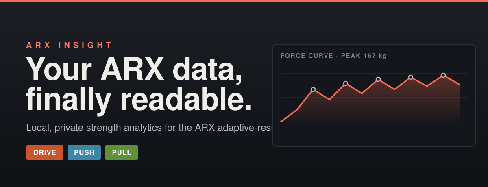
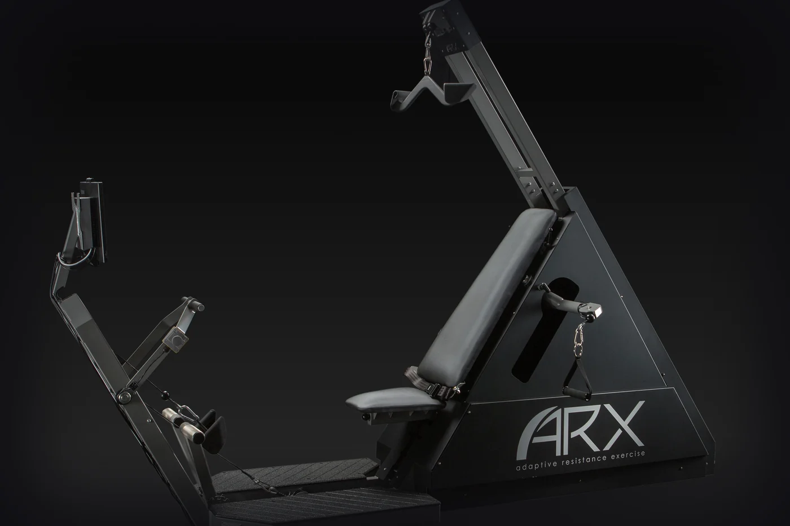
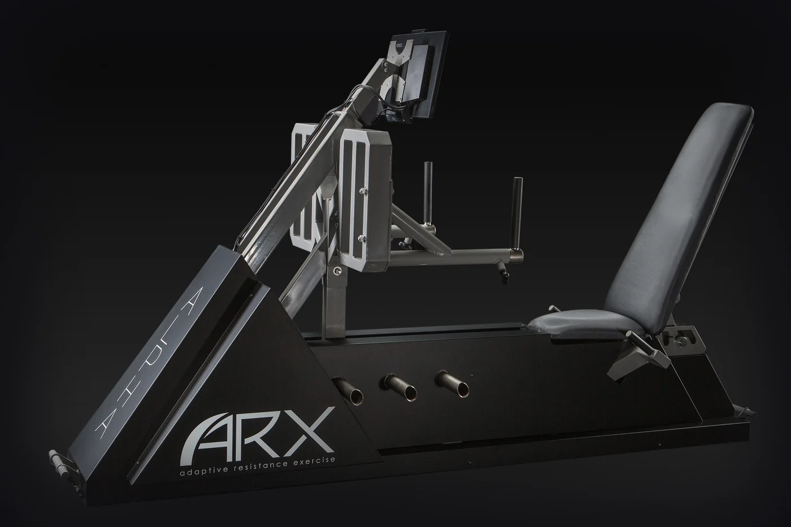
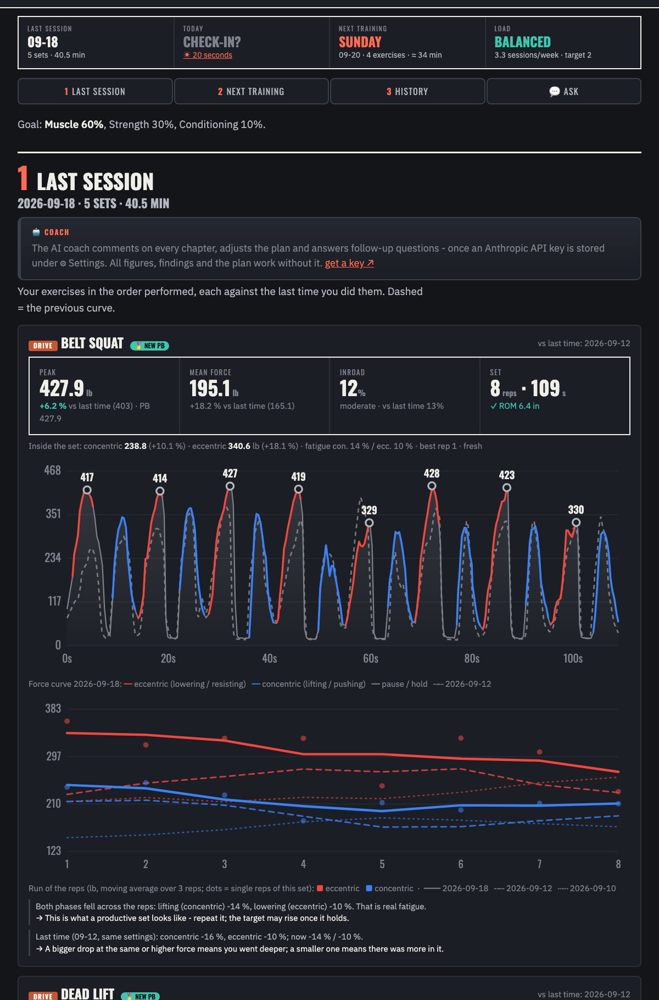
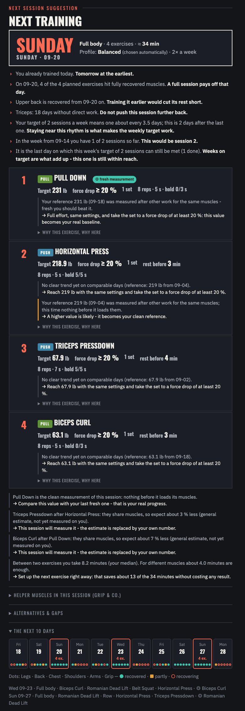
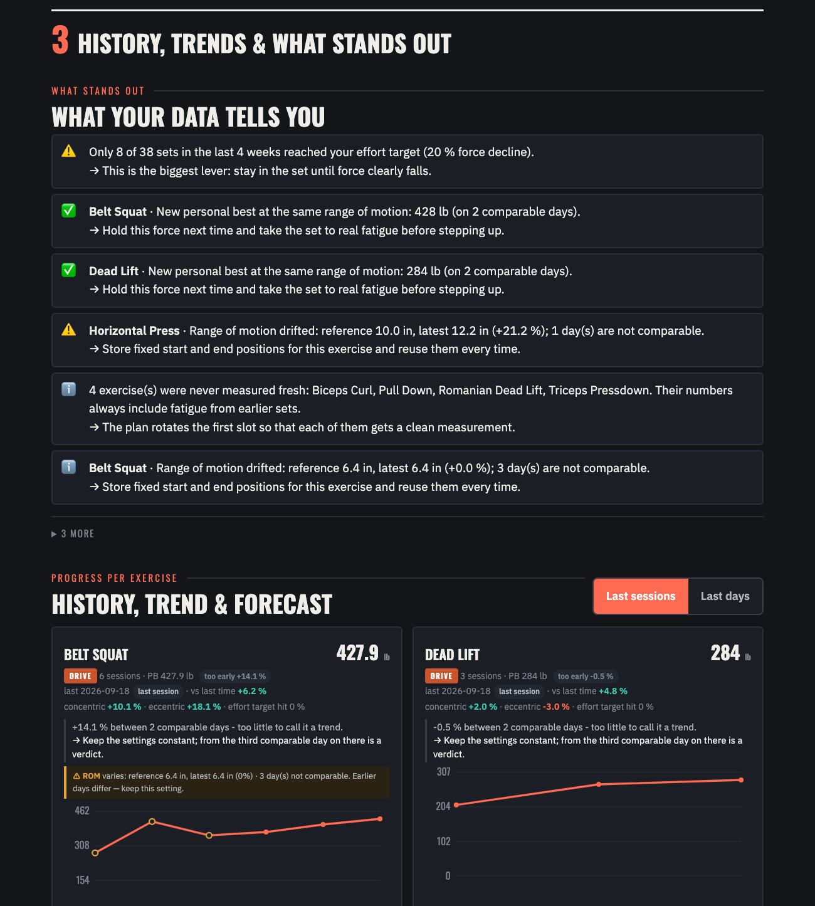
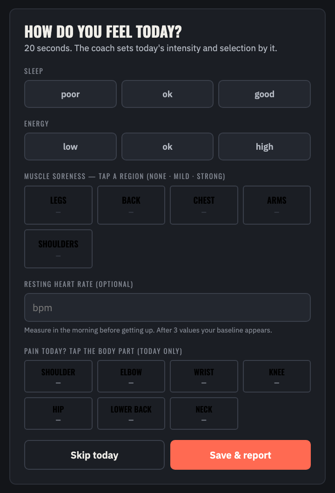
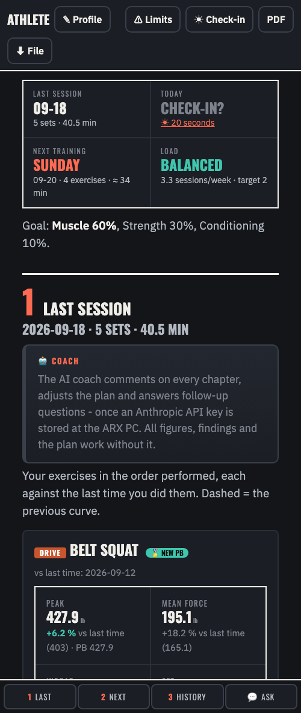
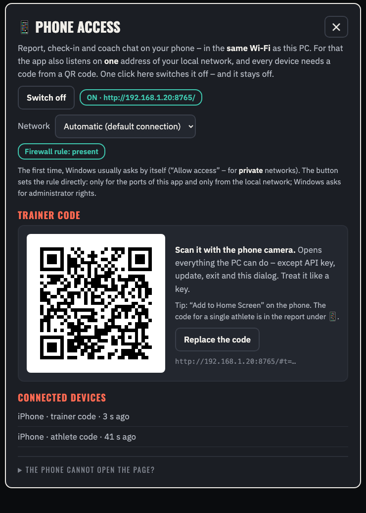

<!-- ARX Insight -->
<p align="center">
  
</p>

       

<h1 align="center">ARX Insight</h1>

<p align="center">
  <b>ARX workout data analysis <i>and</i> a digital coach for the ARX adaptive-resistance machine — local and private.</b><br>
  No juggling of ARX export data (CSV files from the ARX app): ARX Insight reads every rep straight off the machine's<br>
  local database and turns it into real sport-science metrics —<br>
  then <b>builds your training plan from your own data</b>: the next day, the exercises, their order and the targets,<br>
  re-planned after every session and every check-in, and <b>checked against what you actually did</b>.<br>
  An optional AI coach (your own Claude API key) explains it, adapts it within the rules and answers your questions —<br>
  all on your own PC.
</p>

<p align="center">
  
  
  
  
</p>

---

## Why this exists

ARX gives you a brilliant machine, but its analysis lives only in the cloud, with no way to
dig into your own numbers over time. Yet all of your data sits **locally** on the PC next to the
machine. **ARX Insight** is the missing local companion: it opens a read-only copy of that data
and shows you what actually happened — and what to do next.

It is two things in one. An **analysis tool**: what happened inside every set (concentric and
eccentric apart), what is really progress and what is only a different range, order or tempo. And a
**digital coach**: a planner that knows how recovered every muscle is, what your weekly rhythm,
your goal, your time budget and today's check-in ask for — and writes **one plan** from that: when
to train next, which exercises, in which order, with which targets. The plan is dynamic (it changes
with every set you record, every check-in, every setting), it explains each decision with its
numbers, it remembers what it recommended and tells you next time what you did with it — targets
met, exercises skipped, effort reached. It works without any AI; with your own Claude API key an
AI coach reads the same data, may adjust the plan inside the engine's safety rules and answers
follow-up questions in a chat.

> Not affiliated with ARX. Independent, community-made, experimental. Not medical advice.

## What you get

- 🔁 **Last session first** — the exercises you just did, in the order performed, each against the previous time you did them: the force curve with the previous set as a dashed ghost and — since v0.4.1 — coloured by phase (**eccentric always red, concentric always blue**, pauses grey), below it the **run of the reps**: per-rep force of each phase as a moving average, for today (solid), last time (dashed) and the time before (dotted), lined up by rep number so a changed tempo does not shift the comparison, with a sentence on what the shape means (both phases fade = real fatigue, only the concentric fades = keep resisting, nothing fades = the set ended early …); peak / mean force / inroad / ROM deltas, a new-PB badge, and a note when tempo or pauses changed between the two sets (they shift force values). Below: the session table and whether the day before was too close for the muscles you hit again.
- 🧹 **Only real sets count** — machine tests, familiarisation sets, aborted attempts and false starts (the same exercise restarted a minute later with more reps) are recognised and excluded from every number. The report says how many and why.
- 🔥 **Effort — "fatigue in the set"** (deep ≥ 20 % · medium 10–19 % · light < 10 %; the force lost from the strongest stretch of the set to its last reps; the goal sets the target: deep for size, medium for strength) — did the set reach deep fatigue, or were the early reps sub-maximal? Since v0.4.0 measured on the **concentric and eccentric phase of every rep** (time-weighted means, the turnaround spike of a phase left out) instead of single peak values; a set that merely started low no longer reads as "fatigue", and one eccentric spike no longer reads as "deep".
- 🔬 **Inside the set** — concentric and eccentric strength apart (mean of your three best reps, robust against pause and tempo changes), fatigue per phase, the best rep, a start that was too cautious, force by third of the range, holds that were programmed but not really held.
- 🧪 **Your own evidence, with n** — every set knows its context within the visit: *fresh*, *pre-loaded* (an earlier exercise used the same muscles) or a *repeat* set. From that the app measures what an exercise really loses after another one, what a second set delivers, whether rest or position matters **for you** — each with the number of observations and a confidence label, blended with a general estimate while n is small, and never extrapolated (a "rest effect" must beat shuffled data before it is believed). Progress is judged on comparable days only: same range, tempo, protocol and grip-aid state, no learning days.
- 📈 **Progress factors per exercise** — your own baseline = 1.00, concentric and eccentric separately, status (*progressing · stable · plateau · regressing · lower but pre-loaded · too early*), a rate per week only when the data carries it, how often you reached your effort target — and a strength index across exercises. **No number without "what does this mean for me?" and "what follows?"**: every KPI, finding and plan decision carries both sentences (English / German, in your units), without any AI.
- 🚩 **What stands out** — ranked findings: effort target missed, new comparable bests, range drift, changed settings, order and repeat effects, plateaus, neglected muscles, a missed weekly target, unsteady force … each with meaning → action.
- 🧭 **Progress per exercise** — best set per day, "vs last time", trend and a cautious forecast, on two axes (last sessions / last days).
- 📏 **Range-of-motion validity** — force is only compared between days that used the same ROM (within 10 % of the exercise's reference; on a 30 cm press that is 3 cm — a shift of at most a tenth of the range at one end, and less than the day-to-day scatter of a peak-force measurement itself, see `science.json` → *range_of_motion*). Days with a different ROM are shown but excluded from trend and forecast, and the exercise gets a visible ROM warning instead of a fake trend. A deliberately shortened range on a restricted exercise becomes the new baseline instead of a nag.
- 🔁 **A missed effort target is acted on** (v0.10.0) — the coach facts do not just note that a set ended too early. Once: the number holds and the cue is intent (all-out from the first repetition, the set ends when the force breaks down, not when the repetitions are over). Twice in a row: the set-up changes — one second slower per direction (never beyond 5 s, i.e. inside the tempo band where results are equal), no pauses at the turnarounds, same repetitions; once those are exhausted, two repetitions more. The row shows the change next to the old settings, and the comparison basis restarts with the new settings. A day planned sub-maximal (careful, light, limited) is not a miss.
- 🧠 **Muscle-level recovery** — readiness is judged per muscle, not by the calendar or by Push/Pull/Drive: a set loads its target muscles at the effort it reached and its limiters one level lighter; a muscle is ready again when the rest its last hard load required has passed (deep 3 days; moderate and sub-max 1 — a set not taken to failure recovers in about a day, so a fruitless set causes no rest debt). Two sessions on consecutive days are fine when they used different muscles. Per exercise you see *ready*, *limited* (a limiter such as the grip is not fresh — train sub-max) or *not ready*, each with a date.
- ☀️ **Daily check-in** (20 seconds, skippable) — sleep, energy, resting heart rate against your own baseline, and **restrictions today** (v0.9.0): tap a sore muscle region or a painful joint once for *go easy* (sub-maximal, no target number) or twice for *leave out*, and every exercise it touches lights up right below — change single ones as you like (sore legs, but the belt squat anyway). The exercise tiles are what the plan obeys; the body parts are shortcuts, and soreness still feeds the transparent 0–100 wellness score (in the spirit of the Hooper / McLean questionnaires) that goes to the coach. An elevated resting HR or poor sleep means a light day. Since v0.8.1 you can also say **how much time you have today** (optional): an upper limit for a session planned for today — a plan that does not fit is cut the way a trainer would cut it (extra sets first, then the exercises that can wait best; the big exercise of each movement group and muscles that would otherwise wait too long stay), what was left out is named and comes first next time. More time never makes the plan longer.
- 🛌 **Load flag on the last 7 days** — *overload* only when a muscle was loaded hard again before its rest was over (or the check-in says so), *underload* when every recent session was light, *detraining* after 10+ days off. Not judged on your first weeks forever.
- 🧾 **Session sequence** — the order of your sets within each day, the rest before each one, machine pauses, work density, false starts, and rule-based flags: too many sets, a scattered full-body day on a split plan, the same exercise or muscle hit again within 5 minutes, and a density shift that betrays changed pause/tempo settings (only against a consistent baseline).
- 🤝 **Shared limiters** — knows that Dead Lift, Row, Pull Down and Biceps Curl all hang on the grip: it spots a limiter pre-fatigued by an earlier set, lists the conflicts per day, and orders the plan so a "means" exercise comes before the one that targets that same structure.
- 🧍 **Whole-body index** — a self-referenced score of how close you are to your own bests (ROM-comparable days only), across Push / Pull / Drive.
- 🗓️ **ONE plan: when, what, in which order, with which targets** (v0.4.0) — the muscle-level recovery model is rolled forward day by day: the next date is where a full session is possible *and* your weekly rhythm is met best, with every reason spelled out ("you trained today", "triceps: 18 days without direct work", "last day on which this week's target can still be met"). Exercises are chosen by how overdue their muscles are, your focus per body region and coverage gaps; twins for the same muscles are not doubled. Every session keeps **one exercise as a clean measurement** (nothing before it loads its muscles — never-measured-fresh first), because progress can only be judged on fresh sets. The order is the cheapest of all permutations, using **your measured order effects** where they exist; "a helper before the exercise that targets it" (Row before Biceps Curl) stays a hard rule. Targets come from your last comparable value, are lowered by the expected loss when something loads the same muscles first, take a small step only when you are progressing *and* the last set was a real one, and turn a plateau into a second set instead of a bigger number. Plus rests, a **helper-muscle budget** (grip & co.) against what you usually do, a note when your change-over times cost you minutes, a 10-day outlook (1–2 sessions a week = full body, 3+ = a rotating Push / Pull / Drive split that keeps every helper with its exercises) — and an honest word when the cadence you asked for is more than recovery allows. You choose **how sessions are built** — automatic, always full body, or a split by groups (the evidence: at equal weekly volume both give the same results, so it is your week that decides) — and with one tap *"next session only push / pull / legs"* for a single session. A **plan ledger** remembers what was recommended; the next report shows *plan vs what you did*.
- ⏱️ **Your time decides the session size** (v0.8.0) — no magic number of exercises: the profile shows what 15 … 90 minutes buy at your own pace (up to eight exercises; a session of seven or eight may go one deeper per body region), the coach knows the price of one more exercise in minutes, and if you train in turns with a partner the app no longer mistakes their set for set-up time.
- 🎯 **Goals asked up front** — a four-question interview: what you want most, your time (sessions × minutes), **time or effort — what do you want to pay with?** (four profiles, each with its price in minutes per week; the app recommends one) and your experience. Optional: focus per body region (more / less / off), a **measurable target** (force on an exercise, body weight or waist, with a date — the app says whether your own measured pace is enough) and **grip aids** per exercise.
- 🪝 **Grip aids (hooks / straps)** — switch them on per exercise and the grip stops counting as that exercise's limiter in recovery, evidence, order and budget; days with and without an aid are never compared with each other. The plan suggests an aid only where studies show a benefit (dead lifts), not for pull-downs.
- ⚖️ **Body values — entirely optional** — weight, waist, arm, chest, thigh, body fat: any subset, whenever you like, no reminders. Shown as a rough trend with its measurement noise, read together with your strength index. Nothing entered = nothing shown.
- 📚 **Science base** — `science.json`: 19 topics, 101 references (meta-analyses, position stands, RCTs), each retrieved from PubMed and cross-checked via Crossref, with the rule of thumb, how *this app* applies it and what does **not** transfer to a motor-driven machine. Every planner default cites its entry (a test enforces it); where the evidence contradicted a planned default it was changed — e.g. **no extra rest days by age alone**, and "maintain" cuts volume but keeps the effort. Your own measured data always outranks a textbook default.
- ⚠️ **Restrictions — one concept** (v0.9.0) — two words everywhere, *go easy* (sub-maximal, no target number) and *leave out*, for today (check-in) or for good (profile). Body parts are shortcuts: tapping *shoulder* flags every exercise that loads the shoulder (which joints an exercise touches is editable per exercise in `exercises.json`), and you keep the last word per exercise. The report lists what is active with a link to change it, and a "restrictions respected?" box mirrors sets of the last 14 days that went hard on an eased exercise, jumped in the eccentric, or trained a left-out one — a mirror, not a diagnosis.
- ⏱️ **Training time & work** — motivational totals (sessions = real visits), per week / month / year.
- 📖 **One page, three chapters** (v0.5.0) — a status strip (last session · today's check-in · next training · load) and then one reading direction: **1 Last session → 2 Next training → 3 History, trends & what stands out**. No side column, no second plan; on a phone the chapters sit in a bottom bar.
- 🤖 **AI coach inside each chapter** using **your own** Claude API key (only aggregated, name-free numbers are sent) — it receives what a human trainer never has in view at once: the run of every rep of the last session (concentric / eccentric), every exercise's series on comparable days, weekly windows, your own measured order and second-set effects with their n, the findings, plan vs what you did, and the engine's plan with the **decision space** around it. Its answer is one structured board (exercise names and dates are fixed lists — nothing can be invented): a verdict per exercise, what it means and what follows, the plan with cues, the history, one focus. It **may change the plan** — date, exercises, order, targets within ±5 %, sets, rests — but the server checks every row against the same rules as the engine (recovered muscles, sub-max where required, effort cap, helper-before-target, every change needs a reason); one repair round, otherwise the engine's plan applies and the board says so. Changes are marked ✎. **It remembers** what it told you (the last three boards travel with every request) and says what it changes and why. The analysis runs in the background, is cached per data state (a reload never bills twice), default model Claude Opus 5 at high effort (Claude Fable 5.1 selectable), everything tunable in ⚙ Settings. The report itself never needs the AI.
- 💬 **Ask the coach** — a chat about *this* report: why this order, what a grip aid would give you, what to do with 20 minutes today. It knows your data, the plan and its own board; answers stream in and survive a locked phone screen; your own name is stripped from what you type. Up to 100 questions per report and per day (a guard against a runaway client, not a ration; the daily count starts again at midnight).
- 📏 **No muscle waits too long** (v0.5.0) — a muscle needs a stimulus at least about once a week to grow. One session a week is therefore always planned as full body, the big push / pull / leg exercise first (a split at that frequency would train each muscle every 2–3 weeks); a region that would wait more than ~8 days is flagged, and with one weekly session and a muscle goal the plan says openly what that dose is documented to deliver. Since v0.7.0 the big slot of a movement group goes to the exercise that reaches the muscles which would otherwise wait too long — so with Overhead Press or High Pull in your repertoire the chest or the lats cannot lose their turn for two weeks — and the remaining slots reach such muscles first (calves once a week before a second arm exercise).
- 🚫 **Exercises you do not do on the ARX** (v0.7.0; since v0.9.0 part of *Restrictions*) — in the profile every exercise of the machine is a tile: *in the plan → I train it elsewhere → not for me → leave out for good (health) → go easy for good (health)* (the health choices since v0.8.7 / v0.8.8, reachable from the check-in as well: a shoulder problem usually rules out the overhead pressing and only eases the rest — switch off exactly what hurts, keep what only needs care in the plan sub-maximally, leave the body part at "ok", and the report tells you if you went harder anyway). Switched-off exercises are never planned, never suggested and the AI coach cannot bring them back. *Elsewhere* (you squat in the gym, curl at home) means their target muscles count as trained there: no "new exercise" suggestion, no frequency warning, not "neglected" — and the plan says honestly that it cannot see that load, so soreness belongs into the check-in. *Not for me* leaves the muscles to your other exercises where they can reach them. Either way a switched-off exercise has **no say in anything that looks ahead** (v0.7.1): for an exercise you never did the report is the very same as if the machine did not offer it, and one with a history keeps its charts in chapter 3 but no longer appears in the readiness lists, the findings, the deload signal, the profile's target and grip-aid lists or in what the AI coach reads.
- 📱 **On your phone, by QR code** (v0.6.0; on by default since v0.6.1, one click switches it off) — press **📱 Connect a phone** on the start screen and scan a code: the **trainer code** opens the whole app on a phone in the same Wi-Fi; an **athlete code** opens exactly one person's report, check-in, profile, coach analysis and **live chat with the coach** (ask about the plan you just got, standing at the machine) — and nothing else. Codes expire, can be renewed, replaced or revoked; API key, update, exit and the codes themselves stay PC-only; a minor's chat is off until the trainer allows it; the report can be downloaded as one file that opens anywhere.
- ⏸️ **Breaks are understood** (v0.5.1) — more than two weeks away is named as what it is. Up to about three weeks nothing is lost: the plan simply continues and holds your numbers for one session. After a longer break your old values are only an orientation — what you reach is the new starting point, and it comes back much faster than it was built. The app never makes you "catch up" with extra sets or sessions (no evidence that this helps), and if your real attendance is too low for a split it plans fuller sessions until your rhythm is back.
- 🖨️ **PDF** in the same dark design with the coach board included, 🌍 **English / German**, **lb-inch / kg-cm**, big touch-friendly UI, an **update notice** on the start screen and in the report with a **one-click update** on Windows (v0.4.1; the check repeats every few hours), Desktop + Start-menu shortcuts that can be pinned to the taskbar, and a deep link (`?user=<id>`, `&anon=1` hides the name for screenshots).

<p align="center"><i>Example report (anonymized):</i></p>
<p align="center">
  
  
  
  
</p>
<p align="center"><i>On the phone (v0.6.0): the report through an athlete code, and the Phone dialog at the PC (demo address and code):</i></p>
<p align="center">
  
  
</p>

## Install on Windows (plug and play)

No IT knowledge needed.

1. On the GitHub page click **Code → Download ZIP**, then unzip it anywhere (e.g. your Desktop).
2. Open the unzipped folder and **double-click `Install ARX Insight.bat`**.
3. That's it. The installer will, fully automatically:
   - install Python if it's missing,
   - set up a private environment and the two required packages,
   - download the Firebird database client if needed,
   - **find your ARX database automatically** (or ask you to pick the file `DB.FDB4`),
   - put an **“ARX Insight” shortcut on your Desktop**, and
   - open the app in your browser.

Next time, just use the Desktop shortcut (or `Start ARX Insight.bat`).

### First screen

On first launch you set language, units, your weekly training target, and — optionally — your
Claude API key (for the AI coach). Then search a person by name, set a training goal with two
simple sliders, flag any limitations, answer the 20-second check-in (how you feel today — skippable),
and read the report. **Exit** returns you to the search screen. The start screen also has
**📱 Connect a phone** (the QR codes; phone access is on by default and can be switched off there) and
tells you when a new version is available.

## Run it manually (macOS / Linux / advanced)

```bash
python -m venv .venv
. .venv/bin/activate            # Windows: .venv\Scripts\activate
pip install -r requirements.txt
python arx_app.py --db "/path/to/Resources/DB.FDB4"
```

Or generate just the report data (no UI): `python arx_report.py --db "..." --ai` — and `--ai-payload payload.json` writes exactly what the coach *would* receive, without sending anything (for your own privacy review).

## The exercises it knows

All **17 exercises of the ARX Omni** are mapped (since v0.6.2) — name, movement group, what the
exercise is *for* and which helper muscles tend to give out first. Recovery, the order rules ("a
helper before the exercise that targets it": rows before curls, presses before the pressdown),
restrictions and the planner all build on this table; it lives in `exercises.json` and you can edit
it (a test checks the shipped file for sense).

| Exercise | Group | Kind | Trains (targets) | Helpers that can give out first | Grip aid | DB code |
|---|---|---|---|---|---|---|
| Decline Press | Push | compound | chest | triceps, shoulders | — | `26` |
| Horizontal Press | Push | compound | chest | triceps, shoulders | — | `23` |
| Incline Press | Push | compound | chest, shoulders | triceps | — | `25` |
| Overhead Press | Push | compound | shoulders | triceps | — | `5` |
| Pec Fly | Push | isolation | chest | — | — | `42` |
| Triceps Pressdown | Push | isolation | triceps | — | — | `12` |
| High Pull | Pull | compound | upper back, shoulders | grip | hooks / straps | `41` |
| Pull Down | Pull | compound | lats, upper back | grip, elbow flexors (biceps) | hooks / straps | `4` |
| Row | Pull | compound | upper back, lats | grip, elbow flexors (biceps) | hooks / straps | `3` |
| Biceps Curl | Pull | isolation | elbow flexors (biceps) | grip | — | `11` |
| Pull Over | Pull | isolation | lats | triceps | — | `31` |
| Shrugs | Pull | isolation | upper back | grip | hooks / straps | `13` |
| Belt Squat | Drive (legs / hips) | compound | quads, glutes | — | — | `19` |
| Dead Lift | Drive (legs / hips) | compound | glutes, hamstrings, quads | grip, lower back | hooks / straps | `10` |
| Romanian Dead Lift | Drive (legs / hips) | compound | hamstrings, glutes | grip, lower back | hooks / straps | `20` |
| Calf Raise | Drive (legs / hips) | isolation | calves | — | — | `14` |
| Hamstring Curl | Drive (legs / hips) | isolation | hamstrings | — | — | `43` |

Calf Raise is entered for the belt; done with the bar in the hands it hangs on the grip like Shrugs
(see `_variants` in `exercises.json`). Exercises you do not do on the ARX can be switched off per
person in the profile — they then play no part in the plan at all.

**ARX Alpha:** its exercises (Leg Press, Chest Press, Torso Flexion / Extension / Rotation …) are
not mapped yet — there is no Alpha data to take the codes from. Sets of an unknown exercise are
still analysed and show up as *Unknown exercise codes*; one short set per exercise plus the ARX
app's CSV export is all it takes to map them (see the FAQ).

## How it works

| Piece | Role |
|---|---|
| `arx_report.py` | Read-only engine: opens a **copy** of the Firebird DB, assembles the report, optionally calls Claude |
| `arx_base.py` | Shared base: data directory, units, read-only DB access (one short-lived shared snapshot for the app) |
| `arx_detail.py` | What happened **inside** a set: phases per rep, time-weighted means, effort v3 (cached per set) |
| `arx_evidence.py` | Context of every set (fresh / pre-loaded / repeat), your measured order / repeat / limiter / rest effects with n |
| `arx_history.py` | Weekly / monthly windows, progress factors, findings, optional body trends and target progress |
| `arx_plan.py` | The ONE plan: date, selection, clean measurement, order, targets, helper budget, week plan, plan ledger |
| `arx_ai.py` | The AI coach: name-free payload, structured board (JSON schema), rule validation + repair + engine fallback, memory of delivered boards, background jobs, chat; `ARX_AI_FAKE=ok` runs everything without a key |
| `arx_app.py` | Tiny local web server + the touch UI in `web/` |
| `arx_access.py` | Who may do what: trainer code, one athlete code per person (expiry, renew / replace / revoke, chat switch, daily AI allowance), wrong-code limiter, one-time download tickets |
| `arx_lan.py` | The phone listener (on by default, one switch): bound to ONE private network address (never to all), follows a changed address, Windows adapter / network-profile / firewall checks |
| `web/vendor/qrcode.js` | QR Code Generator by Kazuhiko Arase (MIT licence, unchanged from npm `qrcode-generator` 1.4.4) — draws the codes in the browser, nothing is sent anywhere |
| `windows/firewall.ps1` | On demand only (button in the Phone dialog, UAC prompt): one inbound rule for the app's ports, local subnet, private networks |
| `arx_update.py` | One-click update: downloads the release ZIP from this GitHub page, checks it (newer version, expected files, no path outside the target), unpacks it next to your settings and runs its installer — only after a click on the PC itself |
| `exercises.json` | ARX Omni catalog: exercise code → name / group / targets / limiters / joints / possible grip aids (17 exercises mapped since v0.6.2; `_library` holds exercises whose code is not known yet - currently none) |
| `meanings.json` | The "what it means → what to do" sentences for every code (English / German) |
| `science.json` | The evidence behind the planner's defaults, with verified references |
| `config.json`, `goals.json`, `plans.json`, `access.json`, `ai/` | Your settings, per-person profiles / check-ins / optional body log, the plan ledger, the phone codes, and the coach's delivered boards + chat transcripts (kept **out** of git, in your data folder) |
| `tests/` | `python -m unittest discover -s tests -t .` — synthetic data only; `test_catalog.py` checks the shipped `exercises.json` (vocabulary, order rules without a cycle, joints, aids) |

The ARX database is never modified — the tool always works on a temporary copy.

## Modes of the machine

A set has a **mode**: the movement (dynamic, or a *static* hold - `StartPosition == EndPosition`) and what ends it
(a repetition count, the clock = *Countdown*, the machine's *Inroad Mode*, or an unknown code that is shown as
unknown, never silently treated as reps), plus the phase that carried the work when only one direction did
(negative-only / positive-only reps get no fatigue judgement - the rule needs both phases). Since v0.14.0 holds are
working sets with their own effort method (six time slices) and load the muscles like any set; only the same mode
is ever compared (a hold with holds at the same position, a Countdown set with Countdown sets of the same
duration), and chapter 3 says which modes an exercise's history contains. Timed sets progress by **Output**
(force × time under load, "beat your gray line"), shown per day with the change at equal duration. The machine's
own inroad scale (best rep peak → last rep peak, what its Inroad Mode uses) is shown next to the fatigue in the set
as *machine inroad* - a different scale, never mixed. Definitions live in `contracts/modes-1.md`; the next steps
(recommending a mode by goal and situation, calibrating the machine's Inroad setting to your fatigue target) are in
the roadmap.

## The sibling project: arx-free

`../arx-free` is the owner's independent control software for the same machine (motion, live coach, set recording).
ARX Insight stays the single planning engine; the two share what they must agree on as **contracts** in `contracts/`
(`README.md` there lists them: the history export `arx-export-1` - `tools/export_for_arx_free.py` writes it from a
read-only copy of the database -, the fatigue rule `effort-v3` with shared test vectors, and the words a person reads
`vocabulary-1`). Every contract file carries a SHA-256 in `contracts/MANIFEST.json`, the copy here is byte-identical
to the one in arx-free, and `python tools/contracts.py` (also part of the test suite) fails when the folder drifts
from its manifest, when our own fatigue rule stops matching the vectors, or - with arx-free checked out next to this
repository - when the two projects carry different contract files or a different exercise catalogue. A change starts
in the contract's owner project with a new version, never in passing in the code.

## Privacy

**Local.** Everything runs on your machine; with phone access switched off the app listens on
`localhost` only (see below for the phone listener, which is on by default). Your API
key lives only in the local, git-ignored `config.json`. The database, your keys, profiles, check-ins,
the optional body log, the plan ledger, the phone codes and generated reports never leave the machine.

**What goes to Anthropic (only if you store an API key).** The AI request contains **only aggregated,
name-free metrics** — never a person's name, date of birth, height, weight or free-text note. Two
things are switchable in ⚙ Settings: an **age band + sex** ("50-59, male"; on by default, for
age-appropriate advice) and **relative body changes** ("weight −1.7 % in 38 days"; off by default,
never absolute values). `python arx_report.py --ai-payload out.json` writes exactly what would be
sent, without sending it.

**Phone access is ON by default (since v0.6.1) — one click switches it off, and it stays off.** While
it is on, the app opens a second listener on **one private address of your local network** (never on
all interfaces, never on a public address) — so it is reachable from the same Wi-Fi / LAN, not from
the internet. Windows asks once whether Python may be reached from your network; the start screen
always shows the state (**📱 … phone access ON / off**), and *Switch off* in that dialog closes the
listener at once. What an unknown device in your network gets without a code: the empty app page —
no data, no names, not even the version.
- **Every request there needs a code** from a QR code. The code travels in the address *fragment*
  (`#t=…`, which browsers never send to a server) and afterwards in a request header — not in a URL,
  not in a log. A wrong code is answered like no code; repeated wrong codes block that device for a while.
- **Two kinds of code.** *Trainer*: everything a phone should do. *Athlete*: exactly one person's
  report, check-in, profile / goals, coach analysis and chat — any other person is refused, the
  surname and the birth date are not sent to that phone, the downloaded file carries a date, not a name.
  An athlete code lasts 90 days (renew / replace / revoke at the PC), has a daily AI allowance
  (20 coach analyses and 100 questions - your key pays; it starts again at midnight), and for a **minor the chat is off** until you switch it on.
- **PC-only, whatever code a phone shows:** entering the API key, updating, exiting, switching phone
  access on or off, and creating, showing or changing codes.
- **Plain HTTP inside your network.** There is no certificate on a home network, so the connection is
  not encrypted: use it in a Wi-Fi you trust (WPA2/3, no open or guest network), and **never forward
  the port in your router** — the app is not built to face the internet. If the PC is ever used in a
  network you do not trust (a laptop in a café, a shared office Wi-Fi), switch phone access off.
- The codes are stored readable in `access.json` next to `config.json` (so a QR code can be shown
  again); whoever can read that folder on the PC can read them — like the API key.

## Disclaimer

ARX Insight is an **experimental aid**, not medical, therapeutic, or professional training advice.
**No liability** is accepted; anything you derive from it is at your own risk. If you feel pain or
suspect an injury, consult a physician or qualified trainer.

## FAQ

**How exactly do I install it on Windows? (step by step)**
1. Open your web browser and go to this GitHub page: `https://github.com/joergs-git/arx-insight`.
2. Click the green **`< > Code`** button, then **Download ZIP**. Save the file (it lands in your **Downloads** folder).
3. Open **Downloads**, **right-click** the file `arx-insight-main.zip` → **Extract All…** → **Extract**. A folder `arx-insight-main` opens.
4. Open that extracted folder and **double-click `Install ARX Insight.bat`**.
5. If Windows shows a blue *“Windows protected your PC”* box, click **More info → Run anyway** (it's an unsigned script; the source is this repo).
6. Wait. The installer sets everything up, finds your ARX database, and opens the app in your browser. It also puts an **“ARX Insight”** icon on your Desktop — use that next time.

To **update** later: click **Update now** in the banner the app shows when a new version exists (from v0.4.1; see *How do I update?* below) — or repeat steps 1–4 by hand (download the ZIP again, extract, run the installer). Either way your settings and goals are kept, all shortcuts are pointed at the new folder, and a running old version is replaced automatically — you can delete the old folder afterwards.

**Can two ARX Insight windows run at the same time?**
No — since v0.3.1 exactly one app process runs. Start it a second time (a stray double-click, or an
old Desktop shortcut) and it tells you that ARX Insight is already running, opens it in the browser
and closes itself. Start a **newer** version and it asks the old one to quit, waits for it and only
then starts, so the old black console window disappears by itself. (Before v0.3.1 a Windows quirk
let the old and the new version run side by side until you closed the old window by hand.) The
black window titled *“ARX Insight – close this window to stop”* **is** the app: closing it stops it.

**The coach says “unavailable” — what now?**
The report never depends on the AI. The coach's box names the reason (rejected or missing key, no
credit, rate limit, no internet, service overloaded, a model your account cannot use — Claude Fable
needs 30-day data retention enabled in the Anthropic account, …) and offers **Try again**. Only
successful analyses are stored, so a failed attempt is never billed twice.

**What does the AI coach cost, and when is it called?**
One call per new *data state*: new sets, a new check-in, a changed profile or a new day. The same
data never bills twice — the board is stored and shown again. With the default (Claude Opus 5,
high effort) expect roughly half a US dollar per board, a first chat question about a third of
that, follow-up questions a few cents (the report is cached on Anthropic's side for an hour). In
⚙ Settings you can lower the thinking effort, switch the model, or turn *automatic* off — then the
coach only runs when you tap *Ask the coach*. Limits (guards, since v0.8.2): 100 new boards and 100 questions per
person and day, 100 questions per conversation - the daily counts start again at midnight, a conversation starts
anew with every new board. A stored board shown again is never counted.

**Does the coach remember what it told me last time?**
Yes, since v0.5.0. Every delivered board is kept locally (`ai/boards.json` in your data folder);
the next request carries the last three — date, focus, key recommendations, the planned rows — next
to *plan vs what you did*. The coach is instructed to keep its line unless the data changed, and
to list what it changes and why. The engine has its own memory too: the plan ledger.

**Can the AI invent exercises or numbers?**
Exercise names and dates are fixed lists in the answer format, so it cannot name anything that is
not trainable on that day. Its plan rows are checked by the server against the engine's rules;
what fails is replaced by the engine's plan (and the board says so). Force values it writes in
free text are compared with your data — a number that is not in it is listed under the text.

**Where do I get a Claude API key?**
Create one at [console.anthropic.com](https://console.anthropic.com/settings/keys) → *API Keys*.
Paste it into ⚙ *Settings* in the app. It stays on your machine, and the app sends only
aggregated, name-free numbers — never a person's name.

**Do I need the key at all?**
No. Everything except the coach's texts and the chat works without it: last session comparison, force curves,
progress factors and findings with their explanations, muscle-level readiness, check-in, load &
recovery, the full plan (date, order, targets, week outlook). The key only powers the coach's
comments inside the three chapters, its plan adjustments and the chat.

**What methodology does it use?**
Force (kg/lb) is the progress measure on an adaptive-resistance machine, not "weight". Effort is
judged by **inroad** — the force decline across a set. Progress compares the *best set per day*
(repeated sets in one session are treated as fatigue, not regression) — and only between days
with the **same range of motion**: on an adaptive-resistance machine a shorter ROM stays in the
strong part of the movement and yields a higher peak, so force values from differing ROMs are not
comparable and are excluded from trend and forecast (fewer than 3 comparable days → no trend).
Effort is measured per rep and per phase: the machine's own phase markers split every rep into
its concentric and eccentric half (encoder rising = concentric), each half is averaged over time
without the turnaround spike of its first second, and the set's fatigue is the decline of that
combined series from its best stretch in the first half to the last reps (deep ≥ 20 %, moderate
≥ 10 %). Recovery is **effort-conditioned and muscle-level**: a set loads its target muscles at the
effort it reached (deep → 3 days of rest, moderate and sub-max → 1: a set not taken to failure
recovers in about a day) and its limiters one level
lighter; an exercise is ready when its target muscles are. Consecutive training days are fine
when different muscles were used. The **daily check-in** (sleep, energy, soreness, resting heart
rate, pain — subjective wellness is a well-supported load monitor) can override the calendar.
Within a day the **sequence** is analysed too: rest between sets, work density per wall-clock
minute, repeats of the same exercise or of the same limiting muscle (grip, elbow flexors, triceps,
lower back …) within a few minutes. The plan (v0.4.0) rolls that recovery model forward to find
the date, orders the session by what each exercise is expected to lose to the ones before it (your
measured effects first, general estimates otherwise; an exercise that merely *uses* a limiter always
before one that *targets* it) and cites `science.json` for every default. The engine also knows
adherence, milestones and a reactive deload signal (weeks of consistent training that meet falling
numbers or poor readiness). The AI coach judges on top of all that - inside the three chapters,
within the engine's rules (see *Can the AI invent exercises or numbers?*).

**Why does it ask how I feel before the report?**
Because a coach would. Sleep, energy, resting heart rate and today's restrictions take 20 seconds
and change today's plan: a sore region or a painful joint flags the exercises it touches (*go
easy* or *leave out*; since v0.9.0 the plan obeys those exercise flags and you keep the last word
per exercise), an elevated resting HR (more than ~7 bpm above your own baseline, which forms after
three morning values) or poor sleep means a light day. An **ordinary day** — sleep ok,
energy ok, nothing sore — is a full training day (since v0.8.4 the middle answers no longer make a
session lighter); only a clearly worse signal does, and then the plan says so in plain words: *one
exercise fewer and no all-out sets because of the check-in — not a question of time*. You can skip
it; it is asked once per day and editable from the report (☀ Check-in). Everything stays in the
local `goals.json`.

**Three sessions a week — why does the plan not wait for the "rhythm"?** *(v0.8.6)*
Three a week means every other day, not three days in a row at the end of the week. In a split
(from three sessions a week) a session trains other muscles than the last one, so the day after an
upper-body session is exactly when rested legs are due — the plan takes it, and it does not wait
until a second group is fresh either: a group whose exercises are only *limited* (a helper such as
the biceps still recovering) gets its turn fresh, the rested group trains now. Only a full-body
session is held back when it comes sooner than the rhythm; the muscle-level recovery decides the
rest. The week outlook then reads Mon · Wed · Fri, not Wed · Sat · Tue.

**Something hurts today — do I have to change my profile?** *(v0.9.0)*
No. The check-in has one block *Restrictions today*: tap a sore muscle region or a painful joint
once for **go easy** (sub-maximal, no target number) or twice for **leave out** — every exercise it
touches lights up right below (a region through its target muscles, a helper muscle only ever
"go easy"; a joint through the joints listed per exercise in `exercises.json`), and one tap on such
a tile says *not this one* (sore legs, but the belt squat anyway). Tiles you set by hand walk the
whole cycle *as planned → today go easy → today leave out → for good go easy → for good leave out*;
the "for good" states land in the profile with the same save. The plan obeys the exercise tiles,
today only — tomorrow the exercise is planned normally again — and the row says why (*your
check-in (muscle soreness): go easy today*). Nothing of it looks back at earlier sets. The screen
closes with ✕ (or Escape) without saving; *Skip today* is the only thing that stops the question
for the day.

**Mild or strong soreness — what is the difference?**
One tap or two. *Go easy* (mild) keeps the exercises of that region in the plan without a target
number — the all-out set is what a not-quite-recovered muscle should skip; *leave out* (strong)
takes them out of a session planned for today, and if nothing of the session is left, the plan
moves on to the next possible day and says so. Both answers also lower the wellness score, so a
clearly sore day is a moderate day. Since v0.9.0 the soreness answer itself no longer blocks a
region behind your back: what you see on the exercise tiles is exactly what the plan does.

**The set ended too early — what happens next?** *(v0.10.0)*
A set that ends at a 10 % force drop when your goal asks for 20 % was a strength test, not a
stimulus — and a trainer would do something about it. The plan does: after **one** such set the
number holds and the row says what to change in your head (all-out from the first repetition, the
set ends when the force breaks down). After **two** in a row it changes the parameters: one second
slower per direction (never beyond 5 s per direction — within 0.5–8 s per repetition the results are
the same, only "super slow" is worse), no pauses at the turnarounds, same repetitions; when tempo
and pauses are already used up, two repetitions more. The change is shown with a ⚙ next to the old
settings, the AI coach may pick the repetitions instead but may never hold the number a third time
without changing something, and the comparison basis starts anew with the new settings. Days you
were told to go easy on do not count as misses. A set below the target is a real load, just not the
stimulus a size goal needs — and it costs only a day of rest *(v0.11.0)*. Since v0.12.3 the report
calls the measure what it is — **fatigue in the set**, deep / medium / light — with a one-line
explanation and your own target at the top of chapter 1, and the coach uses the same words:
while you are still on the machine (last set less than an hour ago) chapter 1 says *once more, now,
properly* for exactly those exercises; afterwards their muscles are free again the next day — the
plan re-plans the same exercises and says so, instead of making you wait for a rhythm. For a
**strength** goal the pauses at the turnarounds are kept when the set-up changes — a rest-pause serves
tension, which is what a strength goal wants — so the lever is the tempo, then the repetitions
*(v0.12.0)*. And every intent cue reads the same way ARX coaches it: build the force fast but smoothly,
the machine sets the speed, never a jerk.

**I am new to the ARX — does the plan push me to the limit right away?** *(v0.12.0)*
No. With *experience: new* in the profile the first **two** sessions ask for a moderate effort on
purpose — about half of what you have, learn the movements, build the force smoothly — and the
plan says so above the session. Nothing counts as a missed target in those sessions and nothing
escalates; next time the number is your own, to beat by what feels comfortable. From the third
session the goal's effort applies (for a size goal: sets taken to a real force drop). This is the
ARX Academy's own practice; the first maximal eccentric bouts are also where the soreness comes
from (`science.json` → *eccentric*).

**What does "limited" mean for an exercise?**
Its target muscles are recovered, but a *limiter* — the grip, the elbow flexors, the triceps on a
press — is not fresh yet (for example after a deep Biceps Curl two days ago). You can train it
sub-max; the limiter may end the set early. "Not ready" means a target muscle itself still needs
rest; the date tells you when.

**Which sets are excluded, and why?**
Sets under 4 reps or 40 s (machine tests, familiarisation, positioning), sets the machine logged as
ended early with too few reps, and false starts (the same exercise restarted within 3 minutes with
more reps). They would otherwise show up as bogus bests, fatigued "repeats" or short-rest flags. The
report states the count per reason; nothing is deleted.

**How does the plan pick a target?** *(v0.4.0)*
From your last **comparable** value of that exercise (same range, tempo, protocol and grip-aid
state — fresh days when you have two of them). A step of 1–3 % (your own rate) only when the
exercise is progressing **and** the last set reached your effort target; a set that stopped short
gets the same force and "finish it" instead; a plateau with honest effort gets a second set; the
session's clean measurement says "match or beat your reference, this becomes your baseline". If
the exercise is planned after one that loads the same muscles, the target is lowered by the
expected loss — your measured one where it exists — and says so. Careful, limited and new
exercises get "sub-max" instead of a number. The rules and thresholds sit at the top of
`arx_plan.py`, each with its `science.json` entry.

**Why is the next session on that day?** *(v0.4.0)*
The reasons are listed under the date: what is recovered by then, what is overdue, your weekly
rhythm (7 ÷ sessions per week), whether the week's target is still open, a poor check-in. If you
are standing in the gym anyway, *Training today anyway?* shows the session that fits today.

**What is the "fresh measurement" (◎) in the plan?**
Progress can only be judged when nothing before a set has loaded its muscles. Many exercises are
never measured that way — a Pull Down that always follows the Row, for example. So every session
gives one exercise the clean slot, never-measured-fresh first, then the oldest measurement.

**What are the four "time or effort" profiles?**
*Least time, full effort* (one all-out set per exercise, one exercise per trained body region),
*Balanced* (one hard set, a plateau gets a second one), *More time, less brutal* (sets stop short
of the limit, a second set on the main exercises makes up for it) and *Maintain only* (fewer
exercises, no steps — but the sets stay hard, because intensity is what preserves an adaptation).
Each shows its price in minutes per week; leave it on *Automatic* and the app picks one from your
goal, time and experience. A low / medium / max scale is deliberately not asked: with one set per
exercise effort is a requirement, not a taste, and most people would pick the comfortable middle.

**I use lifting hooks or straps — does that matter?**
Yes. Switch them on per exercise in the profile (*Grip aids*): from that day the grip no longer
counts as that exercise's limiter, and days with and without the aid are no longer compared —
otherwise the jump that came with the hooks would look like progress.

**Do I have to enter my body weight or measurements?**
No — never. *Body values* is an optional, collapsed card in the profile; nothing reminds you. With
two readings a few weeks apart you get a rough trend, read together with your strength index.
Scales and tape measures vary more than real change does, so only the trend counts.

**The report shows "Unknown exercise codes" — what now?**
Someone performed an exercise that `exercises.json` does not know yet — all 17 ARX Omni exercises
are mapped, so this will usually be an **ARX Alpha** exercise (Leg Press, Chest Press, Torso
Flexion / Extension / Rotation …). Add an entry with the code as the key (name, group, kind,
`targets`, `limiters`, `joints`) — copy a similar exercise. To find out which code is which: let a
test person do one short set of each exercise, export that person's sets as CSV in the ARX app and
match the rows to the codes by their time stamps. Until then the exercise counts as
"Exercise <code>" and cannot take part in recovery or planning properly. Pull requests with Alpha
codes are very welcome.

**Where do the recommendations come from — sport science or the app's taste?**
Both, and they are kept apart. `science.json` holds the evidence (verified references, evidence
level, what does not transfer to a motor-driven machine — no controlled trial of a one-set, all-out,
motor-driven protocol exists yet, and the file says so). Every planner default cites its entry.
Your own measured data outranks any default, and a default is labelled as one.

**Why does an exercise say "no trend · ROM"?**
Its range of motion changed between sessions by more than 5 %, so the force values of those days
cannot be compared. Set fixed start and end positions for that exercise on the machine; once three
comparable days exist, the trend returns.

**What is a "limiter"?**
The structure that gives out first even though it is not what the exercise is for — the grip on
a Dead Lift or Row, the triceps on a press. Several exercises sharing a limiter fatigue it
cumulatively within one session. `exercises.json` carries `targets` and `limiters` per exercise;
you can extend the vocabulary there.

**Will it change or damage my ARX data?**
No. It only ever reads a temporary **copy** of the database.

**How do I update?**
The app checks GitHub when it starts (and every few hours while it runs) and shows a banner on the
start screen and in the report when a newer version exists. From v0.4.1 the banner has an **Update
now** button (two clicks — the app restarts): it downloads the release ZIP from this GitHub page
over HTTPS, checks it (a newer version, the files a release must have, nothing that would land
outside its folder), unpacks it into `%LOCALAPPDATA%\ARXInsight\app\` and runs its installer, which
refreshes the packages, re-points the shortcuts and starts the new version; the running one closes
by itself. Your settings, goals and environment are kept, the previous version stays as a fallback.
It never updates silently, and the button only works on the PC itself — never from a phone (the phone shows that a new version exists, nothing more).
**Do not want to wait for the banner?** ⚙ on the start screen (the device settings; since v0.9.1 they are no longer in an athlete's report) → *Version & update* → **Check for updates now**
(v0.8.3) asks GitHub at once and brings up the same update button — or tells you that you have the
latest version, or that GitHub could not be reached. The manual way (download the ZIP, run the
installer) keeps working. Versions before 0.4.1 need the manual way once.

**Windows says the download contains a virus — what now?** *(v0.8.3, v0.8.5)*
That is the virus scanner's verdict on the ZIP (in the browser: "virus detected"; in the app: *Windows
security blocked the update package*), not something the app can or should work around. The case
we know: in September 2026 Microsoft Defender's **cloud** classifier called the whole release ZIP
`Trojan:Win32/Sprisky.U!cl` — a verdict on the archive, no file named (`!cl` = cloud, a statistical
judgement, not a signature). v0.8.5 removed what such classifiers dislike and the app never needed:
PowerShell commands handed over in encoded form (they travel as plain readable text now), a hidden
window for the one command that asks for administrator rights, and the installer's attempt to pin
itself to the taskbar; a test keeps these patterns out. ARX Insight
is plain, readable source code — Python, one HTML page and four small Windows scripts (the installer
downloads Python packages and the Firebird client and creates shortcuts; the optional firewall helper
adds one rule for the phone access and only runs after your click and a Windows admin prompt).
Heuristic scanners sometimes misjudge exactly such installer scripts, and the verdict can change with
every new ZIP. What helps: open **Windows Security → Protection history** — it names the file and the
"threat" — and tell us in a GitHub issue, so the cause can be fixed instead of guessed; you can also
report the false positive to Microsoft (*Submit a file for malware analysis*) or check the ZIP on
virustotal.com. Read the scripts before you allow anything — they are short. Nothing is installed
when the package was blocked; the running version simply stays.

**How do I get the report onto my phone?** *(v0.6.0)*
At the PC: start screen → **📱 Connect a phone · show the QR code** (phone access is on by default; if
you switched it off, the same button switches it on again). The first time, Windows may ask whether
Python may communicate on your network — allow it for **private** networks. Scan the **trainer code** with the
phone camera (the phone must be in the same Wi-Fi) and the app opens in the phone's browser; "Add to
Home Screen" makes it an icon. For an athlete: open their report at the PC → **📱 Phone** → let them
scan *their* code — it shows only their own data. On the phone the three chapters sit in a bottom
bar, **Ask** opens the live chat with the coach, **⬇ File** downloads the report as one HTML file
(opens anywhere without the app; "Print → Save as PDF" works from there), and "Forget the access on
this device" at the bottom removes the code from that phone.

**The phone cannot open the page — what now?**
In this order: (1) same Wi-Fi as the PC — not a guest network (guest networks keep devices apart);
(2) Windows network profile **Private** (Settings → Network → your Wi-Fi) — on a *Public* network
the firewall blocks phones, the Phone dialog warns about it; (3) the firewall: press **Allow in
Windows Firewall** in the Phone dialog (one rule for the app's ports, local subnet only; Windows asks
for administrator rights). If you once clicked *Cancel* in the Windows prompt, Windows created a
block rule for Python — the button switches exactly that rule off; (4) VPN off on phone and PC;
(5) the PC must be awake; (6) after a router restart the PC's address may have changed — scan the
code again, or give the PC a fixed address in the router. The dialog lists the devices that
connected, so you see at once whether a scan worked.

**How do I take a code away again?**
Athlete: their report → **📱 Phone** → **Revoke** (gone at once) or **Replace the code** (a new QR
code, the old phone is logged out). Trainer: **📱 Phone access** → **Replace the code**. An athlete
code expires by itself after 90 days; **Renew** extends the same code, so the phone does not have to
scan again. Switching phone access off closes the door for everyone without deleting any code.

**Is phone access safe?**
It is built for a home or gym network you trust: one private address, a random 192-bit code per
device, the athlete code pinned to one person, PC-only functions, no cross-site access, and a browser
policy that blocks foreign scripts, frames and connections. It is **not** encrypted (plain HTTP — see *Privacy*) and must never
be reachable from the internet. If that is not good enough for your setting, switch it off (start
screen → 📱 → **Switch off**; the choice is kept): the app then listens on `localhost` only, exactly
as before v0.6.0.

**Can it put an icon into the taskbar?**
The installer creates a Desktop and a Start-menu shortcut and keeps a taskbar icon up to date on
every update. It cannot create the taskbar icon itself: Windows 10 / 11 deliberately do not let
programs pin themselves. Do it once by hand — right-click the Desktop icon *ARX Insight*
(Windows 11: *Show more options*) → *Pin to taskbar*; the app reminds you once on its start screen.
The shortcuts start the launcher through `cmd.exe` because Windows only offers *Pin to taskbar* for
shortcuts to programs.

**How many exercises does a session have — and why not more?** *(v0.8.0)*
As many as your time holds. *Minutes per session* in the profile is the lever: every button shows
what it buys at **your own pace** (set + change-over, measured from your sessions), e.g. *45 → 4
exercises, 60 → 6, 90 → 8*; *Auto* is simply what you usually take. Eight is the most a session can
hold. Nothing in the science base speaks against a fuller session: alternating exercises for
unrelated muscles costs no result, and for muscle size more weekly sets per muscle is the
best-supported lever (`science.json` → *paired_sets*, *weekly_volume*). What really limits a
session is your time, **shared muscles** (Belt Squat and Dead Lift are not "different muscle
groups" — the second one is extra volume for the same muscles and no clean measurement), the grip
as a helper of many pulling exercises, and — from three sessions a week on — recovery. And more
exercises only pay off when the sets reach their effort target. The AI coach knows the price of
one more exercise in minutes and treats the number of exercises as your time decision, not as a
rule. **Training in turns with a partner?** Say so in the profile: the long time between two
exercises is then your partner's set — the app stops suggesting to set up faster and tells you
what the same session would take alone.

**I only have 20 minutes today — what happens to the plan?** *(v0.8.1)*
Tell the check-in (*Time today*, optional). It is an **upper limit for today only**: if the normal
session fits, nothing changes; if not, extra sets go first (the one hard set per exercise is what
holds and builds), then the session gets smaller — never below two exercises. What stays is what
matters most right now: the big exercise of each movement group, picked so that no muscle falls
out of its weekly stimulus, then whatever else is urgent. The plan says what was left out, and
those muscles are the most due next time, so nothing has to be "caught up". A bigger window never
makes the session longer — for more volume use *Minutes per session* in the profile.

**I squat in the gym / do curls at home — can I switch an exercise off?** *(v0.7.0)*
Yes: profile → *Restrictions (for good)*. Tap an exercise once for **I train it elsewhere**,
twice for **not for me**, three times for **leave out for good (health)** *(v0.8.7)*, four times
for **go easy for good (health)** *(v0.8.8)*; a fifth tap puts it back into the plan. The first three
take the exercise out of every plan, every suggestion and out of what the AI coach may choose from.
*Go easy for good* keeps it in the plan, sub-maximal and without a target number — movement helps a
recovering joint, the all-out set does not; the coach may not plan it harder either. Body parts are
shortcuts here too (since v0.9.0 the separate *limits* screen is gone): tap *shoulder* once and every
exercise that loads the shoulder goes to *go easy for good*, then rule out the overhead pressing
alone with one more tap on its tile — and the *restrictions respected?* box lists an exercise you
did anyway or went harder on than agreed. The difference is what
happens to the muscles: *elsewhere* treats the muscles the exercise is for as trained outside the
ARX — nothing new is suggested for them, no "waits too long" warning, no "neglected" finding — but
the app cannot see that training, so give those muscles their rest before an ARX session that needs
them and enter soreness in the check-in (it flags the exercises for the day). *Not for me* keeps the muscles
the plan's business: your other exercises take over where they reach them. Your history of the
exercise stays in chapter 3 — it is your data. The link *I do not do this on the ARX* next to a
suggested new exercise takes you straight to the setting.

**Full body or a split by muscle groups — which is better?**
Neither: a 2024 meta-analysis of 14 studies found the same strength and muscle gains when the
weekly volume is equal (`science.json` → *split_vs_full_body*). What differs is the week: a split
trains different muscles on consecutive days, so sessions can be shorter and more frequent and a
muscle gets more sets per session; full body reaches everything with fewer visits. With one set per
exercise, more sessions simply mean more hard sets per muscle per week — that is what can add
results, not the structure. *Automatic* plans full body up to two sessions a week and a rotating
Push / Pull / Drive split from three; you can force either in the profile, and the plan tells you
when a choice cannot deliver the number of sessions you asked for.

**I was away for weeks (holiday, illness) — do I just continue?** *(v0.5.1)*
Mostly yes. The studies behind this (see "scientific basis" in the report): training blocks separated by
**3-week breaks** ended with the same muscle and strength as training without a break; after a **10-week
break** strength and size were measurably down, but came back within about 5 weeks. So the plan names
the break and reacts in three steps: **more than 2 weeks** — continue, this one session holds your numbers
(no step up); **4 weeks or more without direct work for a muscle** — the old value is shown as an
*orientation*, what you reach becomes the new starting point, nothing new is added on the comeback day;
**more than half a year** — a controlled, sub-maximal first session (the protection against the machine's
eccentric overload has faded by then). What it never does: extra sets, extra sessions or a harder session
to "catch up" — normal training brings the level back fastest. Everything is recovered after a break,
so the big push / pull / leg exercises come first; whether sessions are full body or a split still follows
how often you train per week — and if you *planned* four sessions but really come once or twice, the app
plans fuller sessions (a split would leave each muscle waiting longer than about 8 days) and says so.

**I have an idea or found a bug — how do I help?**
Open an [issue or discussion](https://github.com/joergs-git/arx-insight/issues) on GitHub, or send
a pull request. Feedback on the methodology and the recommendations is very welcome.

## License

[CC0 1.0](LICENSE) — public domain. Do whatever you like. No warranty.

<p align="center" style="font-size:11px;color:#888">
  <sub>© <a href="https://github.com/joergs-git" target="_blank" rel="noopener">joergs-git</a> · community project, not affiliated with ARX</sub>
</p>
